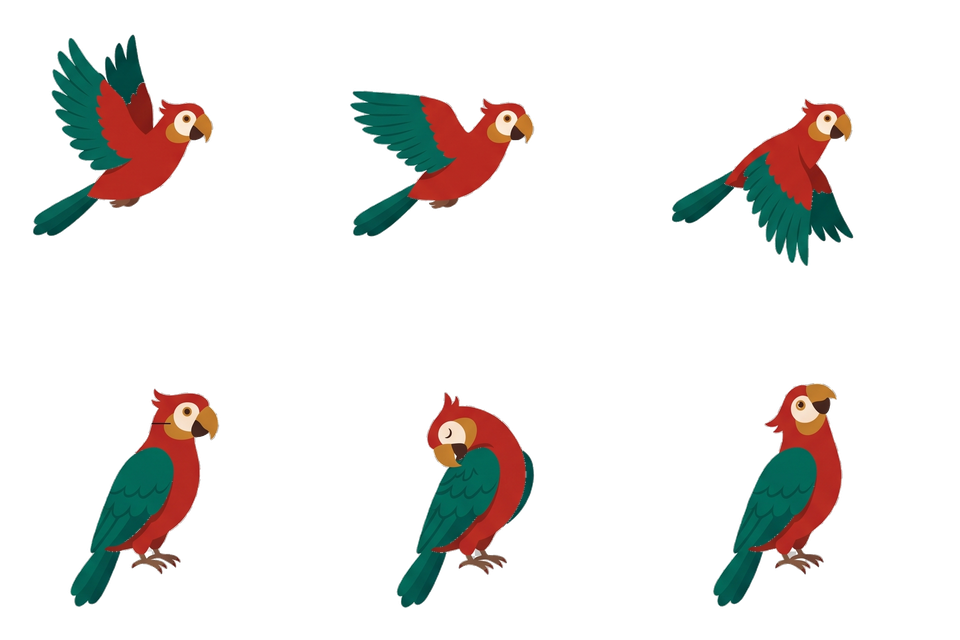

# CA Group — лендинг

Одностраничный сайт агентства, которое оформляет и ведёт карточки бизнеса
в Яндекс Картах и 2ГИС. Екатеринбург, любой бизнес с физической точкой на карте.

Статическая страница: HTML + CSS + JS, без сборки и зависимостей.

## Структура

```
index.html              разметка, весь текст, логотип-бутылка и попугай (SVG)
assets/css/styles.css   стили, mobile-first, светлая тема «старая карта»
assets/js/main.js       меню, маршрут, попугай, форма, переключатель движения
assets/favicon.svg      иконка — та же бутылка
```

## Что нужно поменять перед публикацией

### 1. Контакты — одно место

`assets/js/main.js`, блок `CONFIG` в самом верху:

```js
var CONFIG = {
  brand:    'CA Group',
  telegram: 'cagroup_ekb',    // ник без @
  whatsapp: '79000000000',    // только цифры, начиная с 7
  phone:    '+7 (900) 000-00-00',
  email:    'hello@cagroup.ru'
};
```

Скрипт подставит их во все ссылки с атрибутом `data-contact`.

### 2. Попугай — заменить временную картинку

Сейчас в `index.html` внутри `<span class="parrot" id="parrot">` лежит
**временный SVG-попугай**, нарисованный кодом. Он нужен, чтобы видеть механику:
как птица перелетает между блоками и садится на крестик.

Чтобы поставить свою картинку, замените содержимое этого `<span>`:

```html
<span class="parrot" id="parrot">
  
</span>
```

Подойдёт PNG 512×512 с прозрачным фоном, SVG или кадры спрайта.
Размер задаётся в CSS (`.parrot`), птица вписывается автоматически.

Если у картинки крыло вынесено отдельным слоем — дайте ему класс `parrot-wing`,
и он подхватит анимацию взмаха. Иначе взмахов не будет, но перелёты останутся.

### 3. Условия пилота

В блоке «Кейсы» описано предложение для первых партнёров. Проверьте
формулировки: это обещание клиенту.

## Маршрут и попугай

Вдоль всей страницы идёт **красная пунктирная линия** — она прорисовывается
по мере прокрутки и заканчивается **красным крестиком** прямо над формой заявки.
Попугай прилетает к ключевым блокам и в финале садится на крестик.

Где что настраивается:

- **Точки маршрута** — атрибут `data-route` на секциях. Линия проходит через
  все такие секции по очереди, слева направо и обратно, и заканчивается
  у элемента `#formCard`.
- **Остановки попугая** — атрибут `data-parrot` на элементах. Сейчас их три:
  шапка, заголовок «Что делаем», заголовок «Почему мы». Плюс финальная
  посадка на крестик добавляется автоматически.
- Хотите больше остановок — просто добавьте `data-parrot` нужному блоку.

Путь строится из реальных координат блоков и пересчитывается при изменении
размера окна и после загрузки шрифтов, поэтому линия не разъезжается.

## Переключатель движения

Если в системе посетителя включено «уменьшить анимацию» (Windows →
Специальные возможности → Визуальные эффекты; macOS → Универсальный доступ →
Уменьшение движения), браузер сообщает об этом странице, и вся анимация
выключается — таково требование доступности.

Чтобы такой посетитель не решил, что сайт сломан, в шапке появляется
маленькая кнопка **«Анимация»**. Она видна только тем, у кого движение
отключено системно. Нажатие ставит `data-motion="on"` на `<html>`,
включает анимацию и запоминает выбор в `localStorage`.

Всем остальным кнопка не показывается вообще.

## Как работает форма

Бэкенда нет специально. Три поля: имя, как найти заведение, способ связи.
При отправке скрипт проверяет поля, собирает текст заявки, копирует его
в буфер и открывает мессенджер по тому, что указал человек: телефон →
WhatsApp с подставленным текстом, `@ник` → Telegram.

Появится сервер — менять нужно только обработчик `submit` в `initForm()`.

## Оформление

Светлая тема «старая карта»: пергамент `#F6EFE1`, тёмно-коричневый текст
`#2B2119`, красный акцент `#C42B1F` (маршрут, крестик, кнопки), морская
зелень `#1F6F5C` (иконки, галочки). Одна световая тема, все цвета заданы явно.
Шрифты — Unbounded (заголовки) и Golos Text (текст) с Google Fonts.

Пиратская тема держится на визуале: бутылка с картой в логотипе, красный
пунктир с крестиком, попугай. В текстах пиратской лексики нет — обычная
деловая речь.

## Совместимость

- Мобильная вёрстка базовая, десктоп добавляется медиазапросами
  (`620px` — планшет, `940px` — десктоп). Проверено на 320 / 390 / 768 / 1440.
- Блоки видны по умолчанию: анимация появления включается только после того,
  как скрипт убедился, что документ прокручивается сам. Это важно — во
  встроенном высоком iframe наблюдатель молчит, и контент остался бы невидимым.
- Размер шрифта в полях формы — 16px, чтобы iOS не зумил страницу при вводе.
